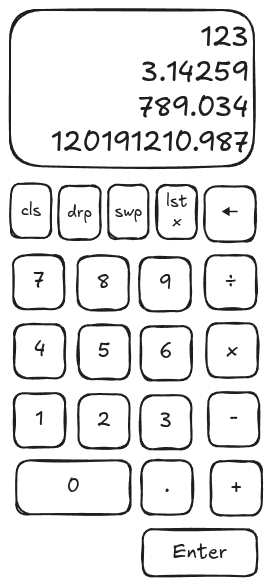

# Vibe Calc - RPN Calculator

A modern web-based **Reverse Polish Notation (RPN) Calculator** built with React, TypeScript, Tailwind CSS, and ShadCN components. This project showcases "vibe coding" - developing a complete application through collaborative interaction with AI while learning frontend development.



## ✨ Features

### Currently Implemented

- ✅ **Number Input**: Full numeric input with decimal point support
- ✅ **RPN Stack Display**: Shows all 4 stack registers (T, Z, Y, X)
- ✅ **Enter Operation**: Pushes values onto the stack with proper stack lifting
- ✅ **Math Operations**: Addition, subtraction, multiplication, division with proper RPN semantics
- ✅ **Stack Operations**: Swap, drop, clear stack, last X recall
- ✅ **Backspace**: Remove digits from current input with proper X register handling
- ✅ **Core RPN Engine**: Pure TypeScript implementation with comprehensive tests
- ✅ **Modern UI**: Built with Tailwind CSS and ShadCN components

### Coming Soon

- 🔄 **Clear X**: Clear current input only (separate from backspace)
- 🔄 **Error Handling**: Enhanced error messages and edge case handling
- 🔄 **Keyboard Support**: Full keyboard navigation and shortcuts
- 🔄 **Mobile Optimization**: Touch-friendly responsive design improvements

## 🧮 What is RPN?

**Reverse Polish Notation (RPN)** is a mathematical notation where operators follow their operands. Instead of typing `3 + 4 =`, you enter:

1. **Type 3** → X register shows 3
2. **Press Enter** → Stack lifts, Y gets 3, X stays 3
3. **Type 4** → X becomes 4, Y remains 3
4. **Press +** → Calculates 3 + 4 = 7

### Stack Registers

- **X**: Current/top value (most recent)
- **Y**: Second value
- **Z**: Third value
- **T**: Fourth value

## 🚀 Getting Started

### Prerequisites

- Node.js 18+
- npm or yarn

### Installation

```bash
# Clone the repository
git clone <repository-url>
cd vibe-calc

# Install dependencies
npm install

# Start development server
npm run dev
```

The calculator will be available at `http://localhost:5173`

### Available Scripts

```bash
npm run dev          # Start development server
npm run build        # Build for production
npm run preview      # Preview production build
npm run test         # Run tests in watch mode
npm run test:run     # Run tests once
npm run test:coverage # Run tests with coverage
npm run lint         # Run ESLint
```

## 🏗️ Architecture

### Project Structure

```
src/
├── components/          # React components
│   ├── Display.tsx     # Stack display component
│   └── ui/             # ShadCN UI components
├── hooks/              # Custom React hooks
│   └── useRPNCalculator.ts
├── lib/                # Core logic
│   ├── rpn-calculator.ts   # Pure RPN engine
│   └── utils.ts       # Utility functions
└── test/              # Test files
    ├── rpn-calculator.test.ts
    └── workflow.test.ts
```

### Key Principles

- **Separation of Concerns**: Pure calculator logic separate from UI
- **Immutable State**: All operations return new state objects
- **Type Safety**: Full TypeScript coverage
- **Comprehensive Testing**: Unit tests for all calculator operations
- **Component-Based**: Modular React components

## 🧪 Testing

The project includes comprehensive tests covering:

- Core RPN calculator operations (enter, setX, stack lifting)
- Stack management operations (swap, drop, clear, last X)
- Math operations (addition, subtraction, multiplication, division)
- Input handling (backspace, number entry, decimal points)
- Error handling (division by zero, invalid operations)
- Real-world calculation workflows

```bash
# Run all tests
npm run test:run

# Run with coverage
npm run test:coverage
```

## 🎨 Tech Stack

- **Frontend**: React 19.1.0 with TypeScript
- **Styling**: Tailwind CSS 4.1.8 + ShadCN components
- **Build Tool**: Vite 6.3.5
- **Testing**: Vitest + React Testing Library
- **Code Quality**: ESLint + TypeScript ESLint

## 📋 Development Plan

This project follows an incremental development approach. See the complete [development plan](./docs/plan.md) for detailed progress tracking.

### Phase 1: Foundation ✅ Completed

- [x] Project setup with React + Vite + TypeScript
- [x] Tailwind CSS + ShadCN integration
- [x] Basic calculator layout
- [x] Number input and display
- [x] Enter operation with stack management

### Phase 2: Math Operations ✅ Completed

- [x] Addition operation
- [x] Subtraction operation
- [x] Multiplication operation
- [x] Division operation

### Phase 3: Stack Operations ✅ Completed

- [x] Swap, Drop, Clear operations
- [x] Last X functionality
- [x] Backspace operation

### Phase 4: Polish 🎯 Current/Future

- [ ] Clear X operation (Step 15 - next up)
- [ ] Enhanced UI/UX
- [ ] Keyboard support
- [ ] Mobile optimization
- [ ] Error handling improvements

## 🤝 Contributing

This project is developed using "vibe coding" methodology - collaborative development with AI assistance. The development process is documented in the [plan.md](./docs/plan.md) file.

### Development Workflow

1. Each feature is implemented as a separate step
2. Tests are written alongside implementation
3. Progress is tracked using checkboxes in the plan
4. Code reviews focus on maintaining separation of concerns

## 📚 Learning Resources

- [RPN Calculator Basics](./docs/plan.md#rpn-basics)
- [Project Setup Guide](./docs/project-setup.instructions.md)
- [Development Plan](./docs/plan.md)

## 📄 License

This project is developed for educational purposes as part of learning frontend development through "vibe coding".

## 🔗 Links

- **Live Demo**: _Coming soon_
- **Documentation**: [./docs/](./docs/)
- **Issues**: Please refer to the development plan for current status

---

Built with ❤️ using React, TypeScript, and "vibe coding" methodology.
