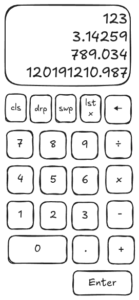

# RPN Calculator Web Project Plan

## Overview

This plan outlines the steps to develop a web-based RPN calculator using React, Tailwind CSS, and ShadCN components, with a focus on "vibe coding" and learning frontend development.

The RPN calculator will support basic math operations (addition, subtraction, multiplication, division) and stack operations (push, swap, drop, clear, last X, backspace, clear X).

The project will be structured to separate the core RPN logic from the UI components.
Being a stack calculator, it will allow users to perform calculations in Reverse Polish Notation (RPN), which is a postfix notation where operators follow their operands.

### RPN Basics

RPN (Reverse Polish Notation) is a mathematical notation in which every operator follows all of its operands. It eliminates the need for parentheses to indicate operation precedence. For example, the expression "3 + 4" in RPN is written as "3 4 +".
In RPN, calculations are performed using a stack data structure. When a number is entered, it is pushed onto the stack. When an operator is encountered, the required number of operands is popped from the stack, the operation is performed, and the result is pushed back onto the stack.
The stack is a Last In, First Out (LIFO) structure, meaning the last number entered is the first one to be used in calculations.

The most relevant stack elements have their own names:

- X is the top of the stack, the last entered number.
- Y is the second element of the stack, the second last entered number.
- Z is the third element of the stack, the third last entered number.
- T is the fourth element of the stack, the fourth last entered number.

Stack operations are essential for managing the stack during calculations. The following operations will be implemented:

- **Enter (Push)**: Push the current input onto the stack.
- **Swap**: Swap the top two elements of the stack (X and Y).
- **Drop**: Remove the top element of the stack (X).
- **Clear Stack**: Clear the entire stack and reset the current input.
- **Last X**: Store the last dropped or operated-on value and allow it to be pushed back onto the stack.
- **Backspace / Clear X**: Remove the last digit from the current input or clear the current input entirely.

#### Regarding the Enter (Push) operation

When the user types a number, it should affect the value of the X register immediately.

The `Enter` operation pushes the value in the X register to the stack (moving the values of the other stack register) but also
keeps its value unchanged.

If the user has typed a value, this is the value that should be pushed to the Y register (keeping it also in the X register).

If the user has not typed a value, the current value of the X register is pushed to the Y register (keeping the value of the X register unchanged).

#### Example Workflow

Here's an example of how the Enter key behavior works in practice:

- **Type 3** → X becomes 3 (Y, Z, T remain as before)
- **Press Enter** → Y gets 3, X stays 3 (stack lifts: old Y→Z, old Z→T)
- **Type 4** → X becomes 4 (the remaining stack elements stay unchanged: Y stays 3)
- **Press +** → Calculates Y + X = 3 + 4 = 7, result goes to X
- **Type 5** → X becomes 5, Y becomes 7 (stack lifts: old Y→Z, old Z→T)

This workflow demonstrates the key principles:

1. Typing immediately updates the X register
2. Enter duplicates X to Y while preserving X
3. New typing replaces X while preserving the stack
4. Operations consume Y and X, putting the result in X

## Architecture Principles

Architecture Principles

- Separation of Concerns: Core RPN logic separated from UI components.
- Incremental Development: Each operation implemented as a separate step.
- Component-Based: Modular React components for maintainability.
- State Management: React hooks for managing calculator state.
- Responsive Design: Mobile-friendly interface using Tailwind CSS.
- No Backend: All logic runs client-side, stored in browser memory.

## Screen Layout

The calculator will have a simple and intuitive layout:

- **Display Area**: Shows the current stack and input. The stack is "upside down" with the top of the stack at the bottom of the display area.
- **Number Buttons**: 0-9 and decimal point.
- **Operation Buttons**: Addition, subtraction, multiplication, division.
- **Stack Operation Buttons**: Enter (push), Swap, Drop, Clear Stack, Last X, Backspace / Clear X (the backspace and clear X functions should be triggered with the same button).
- **Responsive Design**: The layout will adapt to different screen sizes, ensuring usability on mobile devices.

The picture below shows the basic screen layout:

## Technologies

- **React**: For building the user interface.
- **Tailwind CSS**: For styling the components and ensuring a responsive design.
- **ShadCN Components**: For pre-built UI components that enhance the design and usability.
- **TypeScript**: For implementing the RPN calculator logic.

## Development Plan

### Phase 1: Project Setup and Basic UI Structure

- [x] **Step 1: Initialize the React Project:** ✅ **COMPLETED**

  - Set up a new React project using Create React App or Vite.
  - Install the necessary dependencies: `react`, `react-dom`, `tailwindcss`, `postcss`, `autoprefixer`, and `shadcn-ui`.
  - Configure Tailwind CSS in the project.
  - Initialize ShadCN UI components within the project.

- [x] **Step 2: Create the Basic Calculator Layout:** ✅ **COMPLETED**

  - Design the basic layout of the calculator interface. This will include:
    - A display area to show the current stack and input.
    - Number buttons (0-9 and decimal point).
    - Operation buttons (+, -, \*, /).
    - Stack operation buttons (Enter, Swap, Drop, Clear, Last X, Backspace, Clear X).

- [x] **Step 3: Implement the Display Component:** ✅ **COMPLETED**

  - Create a React component to display the stack values and the current input.
  - Decide how the stack will be visually represented (e.g., a list of numbers).
  - Implement basic styling for the display using Tailwind CSS and ShadCN components (e.g., a `Card` or a custom styled `div`).

- [x] **Step 4: Implement the Number Input Buttons:** ✅ **COMPLETED**

  - Create React components for the number buttons (0-9 and ".").
  - Implement the logic to handle button clicks and update the current input value.
  - Display the current input value in the display component.

- [x] **Step 5: Implement the "Enter" (Push) Operation:** ✅ **COMPLETED**
  - Define the core logic for the RPN calculator (initially within the same component for simplicity). This will involve a stack (an array).
  - Implement the "Enter" button functionality: when clicked, it should push the current input value onto the stack and clear the input for the next number.
  - Update the display to show the updated stack.

### Phase 2: Implementing Basic Math Operations

- [x] **Step 6: Implement the "Addition" Operation:** ✅ **COMPLETED**

  - Implement the logic for the addition operation. This will involve:
    - Popping the last two values from the stack.
    - Performing the addition.
    - Pushing the result back onto the stack.
    - Handling potential errors (e.g., not enough numbers on the stack).
  - Create an "Addition" button and connect it to this logic.
  - Update the display to show the result.

- [x] **Step 7: Implement the "Subtraction" Operation:** ✅ **COMPLETED**

  - Implement the logic for the subtraction operation (remembering the order of operands in RPN).
  - Create a "Subtraction" button and connect it to this logic.
  - Update the display.

- [x] **Step 8: Implement the "Multiplication" Operation:** ✅ **COMPLETED**

  - Implement the logic for the multiplication operation.
  - Create a "Multiplication" button and connect it to this logic.
  - Update the display.

- [x] **Step 9: Implement the "Division" Operation:** ✅ **COMPLETED**
  - Implement the logic for the division operation (handling division by zero).
  - Create a "Division" button and connect it to this logic.
  - Update the display.

### Phase 3: Implementing Stack Operations

- [x] **Step 10: Implement the "Swap" Operation:** ✅ **COMPLETED**

  - Implement the logic to swap the top two elements on the stack.
  - Create a "Swap" button and connect it to this logic.
  - Update the display.

- [x] **Step 11: Implement the "Drop" Operation:** ✅ **COMPLETED**

  - Implement the logic to remove the top element from the stack.
  - Create a "Drop" button and connect it to this logic.
  - Update the display.

- [x] **Step 12: Implement the "Clear" Operation:** ✅ **COMPLETED**

  - Implement the logic to clear the entire stack and reset the current input.
  - Create a "Clear" button and connect it to this logic.
  - Update the display.

- [ ] **Step 13: Implement the "Last X" Operation:**

  - Implement the logic to store the last X value from math operations in a separate variable ("last X").
  - Note: LastX should only be set by math operations (add, subtract, multiply, divide), not by stack operations like drop.
  - Implement the "Last X" button to push this stored value back onto the stack.
  - Update the display.

- [ ] **Step 14: Implement the "Backspace" Operation:**

  - Implement the logic to remove the last digit from the current input.
  - Create a "Backspace" button and connect it to this logic.
  - Update the display.

- [ ] **Step 15: Implement the "Clear X" Operation:**
  - Implement the logic to clear the current input.
  - Create a "Clear X" button and connect it to this logic.
  - Update the display.

### Phase 4: Refinement and Styling

- [ ] **Step 16: Improve UI Styling:**

  - Refine the visual appearance of the calculator using Tailwind CSS and ShadCN components.
  - Ensure a user-friendly and responsive design.
  - Ensure that the layout is displayed correctly on a mobile phone screen.

- [ ] **Step 17: Error Handling and User Feedback:**

  - Implement better error handling for cases like insufficient stack elements for operations or division by zero.
  - Provide clear feedback to the user through the display.

- [ ] **Step 18: Keyboard Input:**

  - Add keyboard event handlers.
  - Map keyboard keys to calculator functions.
  - Implement keyboard shortcuts for operations.
  - Add visual feedback for key presses.

- [ ] **Step 19: Code Refactoring (Optional):**
  - If the logic has become too complex within the main component, consider refactoring the core RPN calculator logic into a separate module or custom hook to improve organization and maintainability.

## Testing Strategy

- Test each operation incrementally as implemented.
- Verify RPN logic with known calculations.
- Test edge cases (division by zero, empty stack operations).
- Cross-browser compatibility testing.
